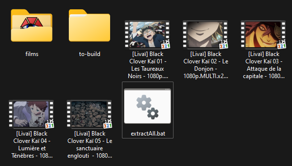

# SubTraductorV3
## Instructions

### 0. Download subtitles for the series
   - Download French subtitles for the series episodes
   - Download subtitle files in other languages
     - ⚠ It is important that these subtitles are synchronized with the French ones  
            If not, refer to: [synchronize files]()
   - You can easily find multilingual and synchronized subtitles from **[Erai-raws](https://www.erai-raws.info/)**

### 1. Extract subtitles from the films (VOST)
   - Extract subtitles with SubTraductorV3
      - Run `SubTraductorV3.exe` and enter `0` for the `Extract Subtitles` option, then follow the program steps

   - Extract ASS subtitles with ffmpeg

cmd/Bat file:
```bat
    for %%f in (*.mkv) do (
        @REM Uncomment the line that matches the movie subtitle type
        @REMffmpeg -y -i "%%~nf.mkv" -map 0:s:<TODO subtitle track ID for vost> -c:s copy "%%~nf.ass"
        
        @REM If the mkv subtitle is in srt format, convert it 
        @REM ffmpeg -y -i "%%~nf.mkv" -map 0:s:<TODO subtitle track ID for vost> -c:s ass "%%~nf.ass"
    )
```

powershell (paste):
```pwsh
foreach ($f in Get-ChildItem -r *.mkv) {ffmpeg -i $f.Name -map 0:s:<TODO subtitle track ID for vost> -c:s copy "$($f.BaseName).ass"}
foreach ($f in Get-ChildItem -r *.mkv) {ffmpeg -i $f.Name -map 0:s:<TODO subtitle track ID for vost> -c:s copy "$($f.BaseName).srt"}
```

Place them in a folder, e.g.:

```
Root folder/
    SubTraductorV3.exe

    films/
        movie ass files
```

### 2. Quick subtitle extraction and renaming (optional)
To simplify translation, it's recommended that subtitle files use absolute numbering rather than season-relative numbering.

- To quickly rename all files and separate them by language, organize the files as follows:  
(If the subtitles are not in archives, create them)
```
Root folder/
    SubTraductorV3.exe

    Season 1/
        language1.7z or .zip 
        language2.7z or .zip
    Season 2/
        language1.7z or .zip
        language2.7z or .zip
```

<p float="left">
  
   
</p>

- **Run** `SubTraductorV3.exe` and enter `3` for the `Extract and rename` option  
    - Follow the program steps (including choosing the episode numbering starting point by season).
  
After execution, a new folder named **`to-translate`** will appear in the root directory.

To avoid retranslating French subtitles, move the French subtitles folder to another location.

**You should have a folder structure like this:**
```
Root folder/
    SubTraductorV3.exe
    
    films/
        .ass subtitle files for the movies

    Sub-French/
        .ass French subtitles
    
    to-translate/
        language1/  
            all .ass files for language 1  
        language2/  
            all .ass files for language 2  
```

#### ⚠ For mkv creation, the `to-translate` folders must only have the language name (e.g., "Portuguese(Brazil)" should be renamed to "Portuguese")

### 3. Generate the configuration file
 
- **Run** `SubTraductorV3.exe` and enter `2` for the `Generate Config` option  

Then follow the program steps:  
1. Enter the path to the movie `.ass` files  
2. (optional) Try to fill in movie info using the fandom database
3. Enter the path to the French subtitle `.ass` files for the episodes
4. Enter the path to the folder with the languages to translate (e.g., `to-translate`)
5. Enter the path where the translated files will be saved
6. Check the messages in the **Configuration Information** table
7. Verify everything is correct, especially the episodes covered if the fandom info was used ([fandom wiki](https://fan-kai.fandom.com/fr/wiki/Guide_des_%C3%A9pisodes))

### 4. Translation

- **Run** `SubTraductorV3.exe` and enter `1` for the `Translate` option

1. Enter the configuration file name, which must be in the same location as the executable
2. Use multithreading for translation: `Y` unless debugging is needed
3. Ensure the config is still correct if it was modified
4. Enter the number (e.g., "1,5,6") of the movies to translate or press "Enter" to translate everything
5. Once translation is complete, a table will display the percentage of subtitles matched with the French episodes
6. If the percentage is red or orange for a movie:
   - Check if an episode is missing in the config; the text of 3 missing subtitles will be shown to search using **vscode** across all `.ass` files if needed
   - Make sure your subtitles and the movie’s subtitles are from the same source (e.g., Crunchyroll vs. Wakanim)

#### ⚠ Only the presence of the `.ass` file in the target language is verified. If there is a mismatch in episode numbering between the French files and those in the target language, the only way to determine this is by importing the translated file for playback in VLC.

### 5. Add new subtitles to the `.mkv` file
#### A copy of the original mkv files will be created.

- **Run** `SubTraductorV3.exe` and enter `4` for the `Create MKV Files` option

1. Enter the path to the folder containing the translations (one folder per language in this location)
    ```
    translated/
        English/
            *.ass
        Spanish/
            *.ass
    ```
2. Enter the path to the folder with the MKVs
3. Verify that the mapping is correct 
4. `Y` to continue, `N` to cancel
5. The files will be created in a `Translated Films` folder in the root of the folder where the MKVs are located

### Synchronize the subtitles
- **Run** `SubTraductorV3.exe` and enter `5` for the `Sync Subs` option
- Follow the steps
  - Works best for files in the same language but may work with different languages
  - This option only works when there’s a single offset in the file but helps assess delays


# See Demo.mp4 for execution example

<video width="50%" height="auto" controls>
  <source src="./Demo.mp4" type="video/mp4">
</video>

## Build:
```powershell
pip install -r requirements.txt
pyinstaller --onefile --noupx --icon "./images/icon.ico" --clean --add-data "./assets/*;assets/" --name "SubTraductorV3" ./main.py
```

## Any issues ?
[contact on discord](https://discordapp.com/users/1012763202137882754)