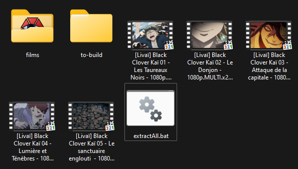
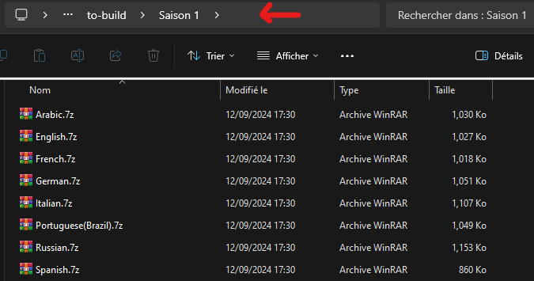

# SubTraductorV3
## Instrucciones

### 0. Descargar subtítulos de la serie
   - Descargar los subtítulos en francés de los episodios de la serie
   - Descargar los archivos de subtítulos en otros idiomas
     - ⚠ Es importante que estos subtítulos estén sincronizados con los subtítulos en francés  
            Si no es el caso, consulte: [sincronizar archivos]()
   - Es posible encontrar fácilmente subtítulos de varios idiomas y sincronizados en **[Erai-raws](https://www.erai-raws.info/)**

### 1. Extraer los subtítulos de las películas (VOST)
   - Extraer los subtítulos con SubTraductorV3
      - Ejecutar `SubTraductorV3.exe` e ingresar `0` para la opción `Extract Subtitles`, luego seguir los pasos del programa

   - Extraer subtítulos ASS con ffmpeg

cmd/Bat file:
```bat
    for %%f in (*.mkv) do (
        @REM Descomentar la línea que corresponde al tipo de archivo de la película
        @REMffmpeg -y -i "%%~nf.mkv" -map 0:s:<TODO ID de la pista de subtítulos vost> -c:s copy "%%~nf.ass"
        
        @REM Si el archivo de subtítulos del mkv es un srt, lo convertimos 
        @REM ffmpeg -y -i "%%~nf.mkv" -map 0:s:<TODO ID de la pista de subtítulos vost> -c:s ass "%%~nf.ass"
    )
```

powershell (pegar):
```pwsh
foreach ($f in Get-ChildItem -r *.mkv) {ffmpeg -i $f.Name -map 0:s:<TODO ID de la pista de subtítulos vost> -c:s copy "$($f.BaseName).ass"}
foreach ($f in Get-ChildItem -r *.mkv) {ffmpeg -i $f.Name -map 0:s:<TODO ID de la pista de subtítulos vost> -c:s copy "$($f.BaseName).srt"}
```

Colóquelos en una carpeta, por ejemplo:

```
Carpeta raíz/
    SubTraductorV3.exe

    películas/
        archivos .ass de las películas
```

### 2. Extracción y renombrado rápido de subtítulos (opcional)
Para simplificar la traducción, se recomienda que los archivos de subtítulos utilicen una numeración absoluta y no relativa a la temporada.

- Para renombrar fácilmente todos los archivos y separarlos por idioma, organice los archivos de la siguiente manera:  
(Si los subtítulos no están en archivos comprimidos, cree estos)
```
Carpeta raíz/
    SubTraductorV3.exe

    Temporada 1/
        idioma1.7z o .zip 
        idioma2.7z o .zip
    Temporada 2/
        idioma1.7z o .zip
        idioma2.7z o .zip
```

<p float="left">
  
   
</p>

- **Ejecutar** `SubTraductorV3.exe` e ingresar `3` para la opción `Extract and rename`  
    - Seguir los pasos del programa (incluido el inicio de la numeración de episodios por temporada).
  
Después de la ejecución, aparecerá una nueva carpeta llamada **`to-translate`** en la raíz.

Para evitar volver a traducir al francés, mueva la carpeta con los subtítulos en francés a otra ubicación.

**Debería tener una estructura de carpetas como esta:**
```
Carpeta raíz/
    SubTraductorV3.exe
    
    películas/
        archivos .ass de las películas

    Sub-Francés/
        archivos .ass de los subtítulos en francés
    
    to-translate/
        idioma1/  
            todos los .ass del idioma 1  
        idioma2/  
            todos los .ass del idioma 2  
```

#### ⚠ Para la creación del mkv, las carpetas dentro de `to-translate` solo deben tener el nombre del idioma (por ejemplo, "Portuguese(Brazil)" debe renombrarse a "Portuguese")

### 3. Generación del archivo de configuración
 
- **Ejecutar** `SubTraductorV3.exe` e ingresar `2` para la opción `Generate Config`  

Luego, siga los pasos del programa:  
1. Ingrese la ruta a los archivos `.ass` de las películas  
2. (opcional) Intente rellenar la información de las películas desde fandom
3. Ingrese la ruta a los archivos `.ass` de los subtítulos en francés de los episodios
4. Ingrese la ruta a la carpeta con los idiomas a traducir (por ejemplo, `to-translate`)
5. Ingrese la ruta donde se guardarán los archivos traducidos
6. Verifique los mensajes en la tabla **Información de Configuración**
7. Asegúrese de que todo esté correcto, especialmente los episodios cubiertos si se utilizó fandom ([fandom wiki](https://fan-kai.fandom.com/fr/wiki/Guide_des_%C3%A9pisodes))

### 4. Traducción

- **Ejecutar** `SubTraductorV3.exe` e ingresar `1` para la opción `Translate`

1. Ingrese el nombre del archivo de configuración, que debe estar en la misma ubicación que el ejecutable
2. Use multithreading para la traducción: `Y` a menos que se necesite depuración
3. Asegúrese de que la configuración siga siendo correcta si ha sido modificada
4. Ingrese el número (por ejemplo, "1,5,6") de las películas a traducir o presione "Enter" para traducir todo
5. Una vez finalizada la traducción, se mostrará una tabla con el porcentaje de coincidencia de subtítulos con los episodios en francés
6. Si el porcentaje está en rojo o naranja para una película:
   - Verifique si falta un episodio en la configuración; se mostrarán 3 subtítulos faltantes para buscarlos con **vscode** en todos los archivos .ass si es necesario
   - Asegúrese de que sus subtítulos y los de la película provengan de la misma fuente (por ejemplo, Crunchyroll vs. Wakanim)

#### ⚠ Solo se verifica la presencia del archivo `.ass` en el idioma a traducir. Si hay una mala correspondencia entre los números de episodios entre los archivos en francés y los del idioma a traducir, la única manera de determinarlo es importando el archivo traducido en VLC para la reproducción.

### 5. Agregar los nuevos subtítulos al archivo `.mkv`
#### Se creará una copia de los archivos mkv originales.

- **Ejecutar** `SubTraductorV3.exe` e ingresar `4` para la opción `Create MKV Files`

1. Ingrese la ruta a la carpeta que contiene las traducciones (una carpeta por idioma en esta ubicación)
    ```
    translated/
        English/
            *.ass
        Spanish/
            *.ass
    ```
2. Ingrese la ruta a la carpeta con los MKVs
3. Verifique que la correspondencia sea correcta 
4. `Y` para continuar, `N` para cancelar
5. Los archivos se crearán en una carpeta `Translated Films` en la raíz de la carpeta donde se encuentran los MKV.

### Sincronizar los subtítulos
- **Ejecutar** `SubTraductorV3.exe` e ingresar `5` para la opción `Sync Subs`
- Siga los pasos
  - Funciona mejor para archivos en el mismo idioma, pero puede funcionar con diferentes idiomas
  - Esta opción solo funciona cuando hay un único desfase en el archivo, pero ayuda a evaluar los desfases.

# Ver Demo.mp4 para ejemplos de ejecución

<video width="50%" height="auto" controls>
  <source src="./Demo.mp4" type="video/mp4">
</video>

## Compilación:
```powershell
pip install -r requirements.txt
pyinstaller --onefile --noupx --icon "./images/icon.ico" --clean --add-data "./assets/*;assets/" --name "SubTraductorV3" ./main.py
```

## ¿Algún problema?
[discord](https://discordapp.com/users/1012763202137882754)